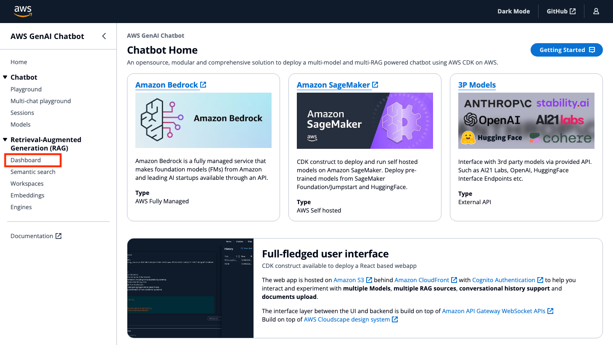
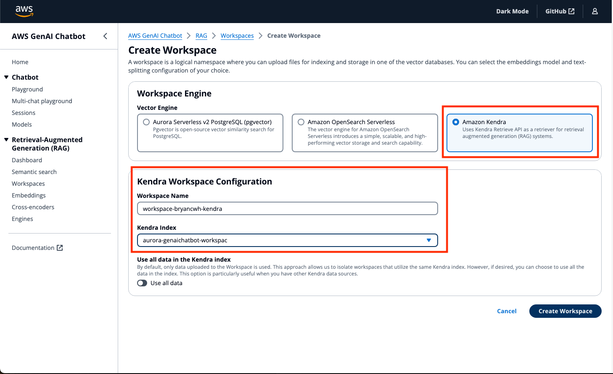
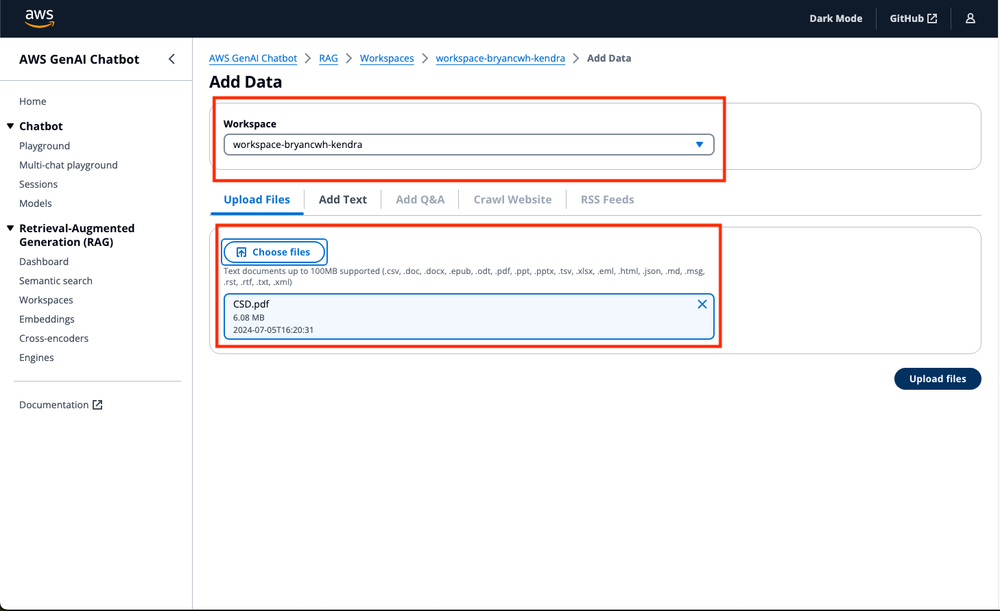

# AWS GenAI Playground Hands-on

Welcome to the xxx Workshop! This guide will walk you through the basics of using the AWS GenAI Playground. This workshop makes it easy for you to start experimenting with a variety of Large Language Models and Multimodal Language Models, settings and prompts.

Specifically, this workshop will cover:
- Creating a Retrieval-Augmented Generation workspace
- Uploading files and web crawling for indexing and storage in one of the vector engines
- Sending queries to separate models at once and see how each one responds based on its own learned history, context and access to the same powerful document retriever, so all requests can pull from the same up-to-date knowledge.

## Prerequisites

Ensure you have the following before embarking on this workshop:
- A AWS GenAI Playground account

## Lab 1: RAG with Amazon OpenSearch Serverless

1. Sign into the AWS GenAI Playground

2. Click **Workspaces** in **Retrieval-Augmented Generation (RAG)** section. A workspace is a logical namespace where you can upload files for indexing and storage in one of the vector databases. You can select the embeddings model and text-splitting configuration of your choice.



3. Create a workspace by clicking on **Create Workspace**


4. In Workspace Engine select **Amazon OpenSearch Serverless**. In Configuration specify a unique workspace name, leave the rest as default, and **Create Workspace**


5. Click **Dashboard** in **Retrieval-Augmented Generation (RAG)** section. On the top right, **Add data** and select **Crawl website**


6. Add a web crawler. **Select the OpenSearch Serverless workspace you have just created**, and specify the **Website Address**. Leave the rest as default. You may use

```
https://www.myskillsfuture.gov.sg/content/portal/en/career-resources/career-resources/job-skills-insights/the-green-economy-explained--trends--skills---jobs-you-need-to-k.html
```


7. Once the website has been crawled, its status should show as **Proccessed**


8. Click **Multi-chat Playground** in **Chatbot** section. 

9. Select up to 3 of your preferred Foundation Models (FMs). **Select the OpenSearch Serverless workspace you have just created**

10. Generate a course outline for module on Carbon Footprint Management. Hint: You may use 

```
You are a curriculum manager in one of the IHLs in Singapore. Your task is to generate a course outline for Carbon Footprint Management based on Singapore Green Plan Initiatives. 
```


## Lab 2: RAG with Amazon Kendra

1. Click **Workspaces** in **Retrieval-Augmented Generation (RAG)** section.

2. Create a Kendra workspace by clicking on **Create Workspace**

3. In Workspace Engine select **Amazon Kendra**. In Configuration specify a unique workspace name, select the Kendra Index that has been created for you, and **Create Workspace**



4. Click **Dashboard** in **Retrieval-Augmented Generation (RAG)** section. On the top right, **Add data** and select **Upload files**

5. Upload your PDF files. **Select the Kendra workspace you have just created**, upload your file from local and select **Upload files**



6. Click on **Start Kendra Data Sync** and wait for the data to sync completely


7. Once Kendra has completed the sync, click **Multi-chat Playground** in **Chatbot** section. 

8. Select up to 3 of your preferred Foundation Models (FMs). **Select the Amazon Kendra workspace you have just created**

9. Generate a rubrics for the course on Computer Science and Design. Hint: You may use 

```
You are a university Lecturer in SUTD skilled in assessing student work. Create a rubric grading for Computer Science and Design class. Your students will be doing a course “Computer Science and Design” based on the document “CSD.pdf” in preparation for the final exam, Format the rubric as a chart and include a rating scale of 1-5.
```


10. You may generate an assessment of the rubrics with the following

``` 
Please generate high-level assessment plan based on the rubric you suggested and its objectives
```

## [BONUS] Lab 3: RAG with Amazon Kendra

Try generating a school timetable for teachers 

<details><summary>Show Hint</summary>
<p>

```
You are an AI assistant designed to help school administrators create optimal school timetables. Your task is to generate a weekly timetable that schedules all required classes, assigns teachers and rooms appropriately, and balances student and teacher workloads. Create a sample timetable framework that has 50 minute periods and accounts for a 1 hour lunch break. The school offers courses in Math, Science, English, History, Art, Music, and Physical Education. The timetable should include period times, class name, teacher name, classroom number, and student roster for each scheduled class period. Could you provide a sample timetable structure for me to review? Please use placeholder names and numbers when referring to classes, teachers, rooms and students. Let me know if you need any clarification or additional information.
```
</p>
</details>

